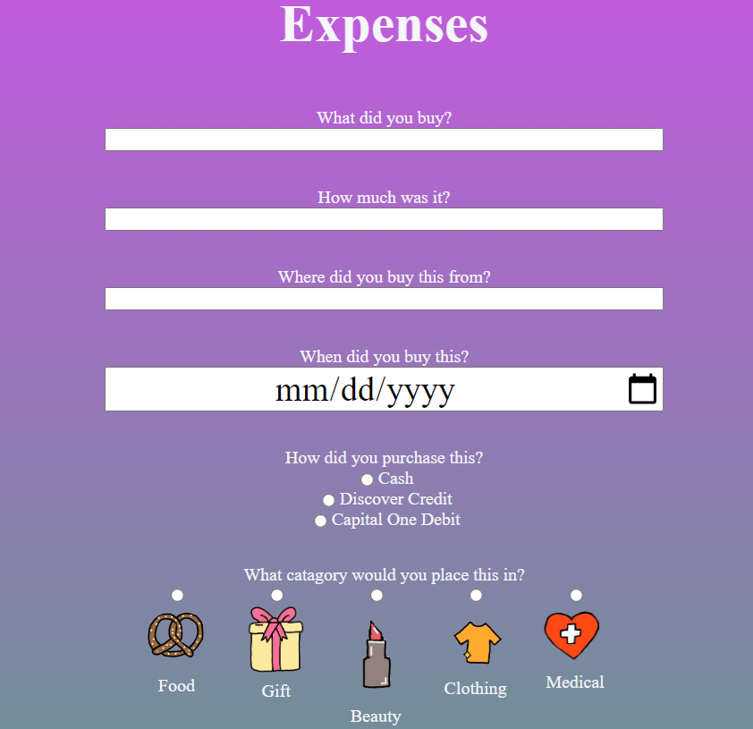
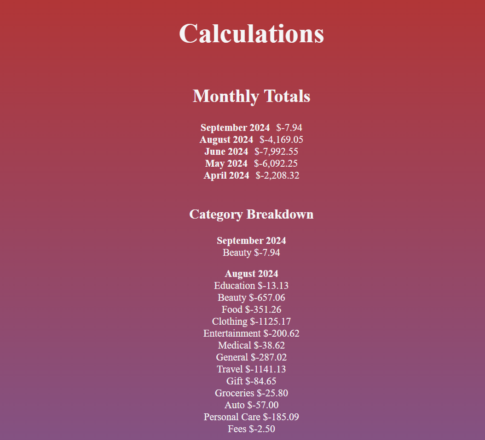

# Money Buddy

A website to track personal expenses. Uses Google sheets API as a data-store.


## Setup

1. `pip install -r requirements.txt`

2. [Create a google api key that has access to your google sheets](https://support.google.com/googleapi/answer/6158862?hl=en)

3. Create a file named config.py and fill it with the following variables:

```
SPREADSHEET_ID= 'SHEETSID'
GOOGLE_SECRET_FILEPATH = 'GOOGLESECRET.json'
```

You can find the spreadsheet id in the url of the google sheets file you wish to use

4. Run `finance_server.py`

## Example usage




## How the data is stored

The code to both write and read from Google sheets is in `sheets.py`.

This is the format the program creates:

Date / Price / Category / Note / Company / Method of Payment\
8/22/24 / -$5.00 / Food / Bagel / Starbucks / Capital One Debit Card

## Future plans

The income tab isn't functional yet, I plan to hook up to secondary google sheet.
